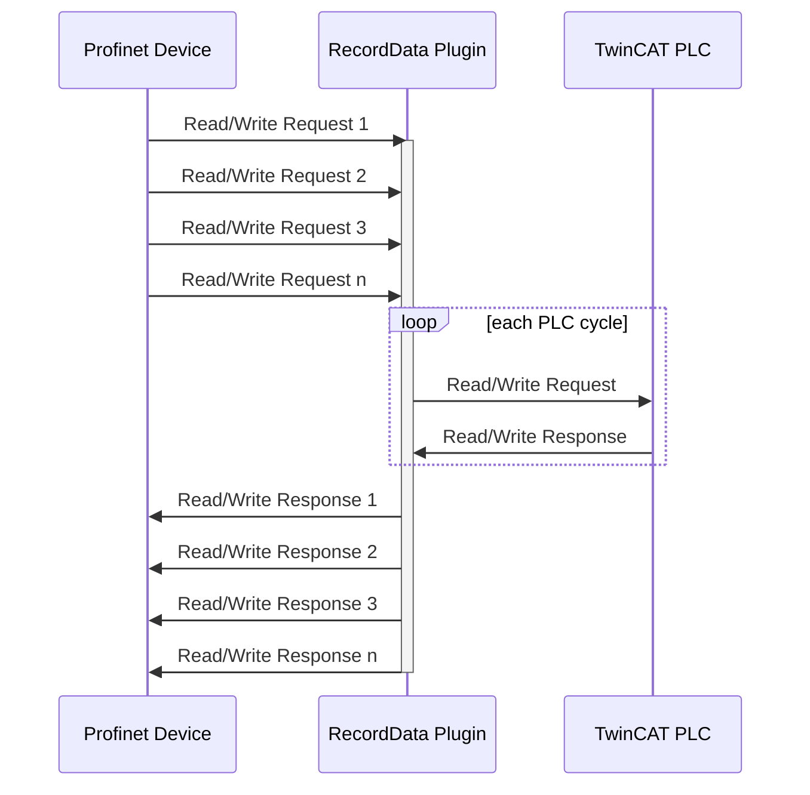

# Open Commissioning Assistant Plugin for Profinet RecordData

### Description
Can be used to send and reveice Profinet acyclic data (RecordData) when connecting a virtual model to a real PLC (Hardware-in-the-loop).

### Quick Getting Started
- Download the zip file from the latest release page
- Unpack and place it in the directory or a subdirectory of the `OC.Assistant.exe`
- Start the Assistant and connect or create a TwinCAT solution
- Add a new plugin instance using the `+` button 
- Select `RecordDataServer`, configure parameters and press `Apply` ([see also](https://github.com/OpenCommissioning/OC_Assistant?tab=readme-ov-file#installation-1))  
- The plugin starts when TwinCAT goes to Run Mode

### Plugin Parameters
- _AutoStart_: Automatic start and stop with TwinCAT
- _Port_: The ADS port of the Profinet Device. Default port is 852.

### How it works
The RecordData Plugin serves as a buffer to store Read/Write Requests (RDREC/WRREC) and Read/Write Responses.
Behaviour models within the TwinCAT PLC can access the Read/Write Requests and send corresponding Read/Write Responses.

